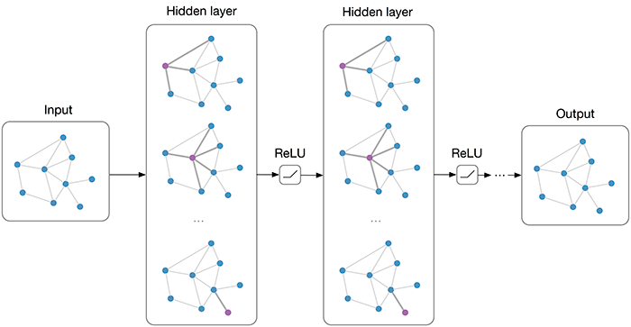

# Graph-neural-network

之前深度学习主要关注例如文字的序列结构、例如图片的平面结构，现在处理这些数据的做法也比较成熟，关注序列任务的NLP领域多用RNN、Transformer、CNN对数据进行Encoder，而关注平面结构的CV领域更多使用CNN及其各种变体对数据进行Encoder。

在现实世界中更多的数据表示并不是序列或者平面这种简单的排列，而是表现为更为复杂的图结构，如社交网络、商品-店铺-人之间的关系、分子结构等等.

